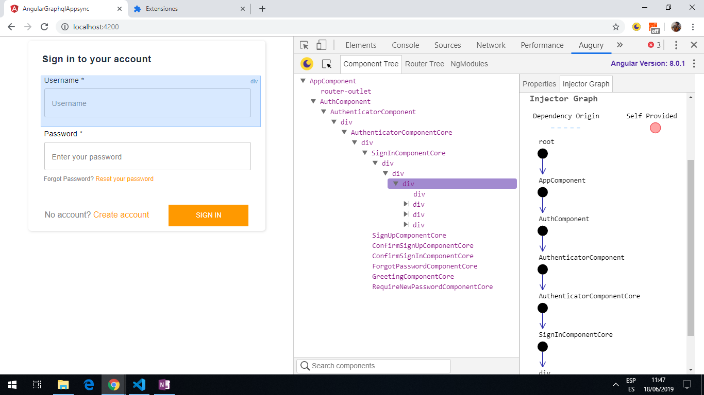
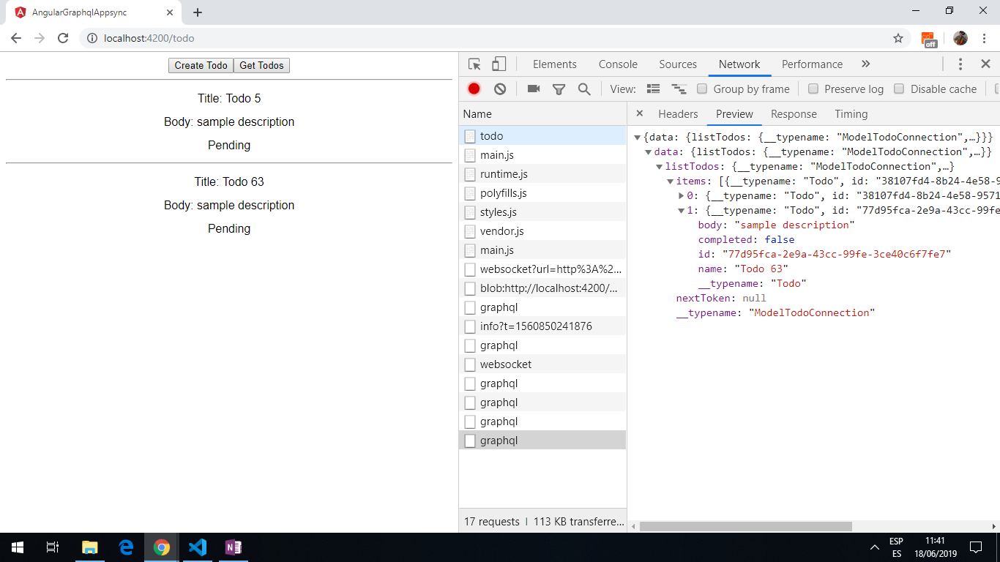
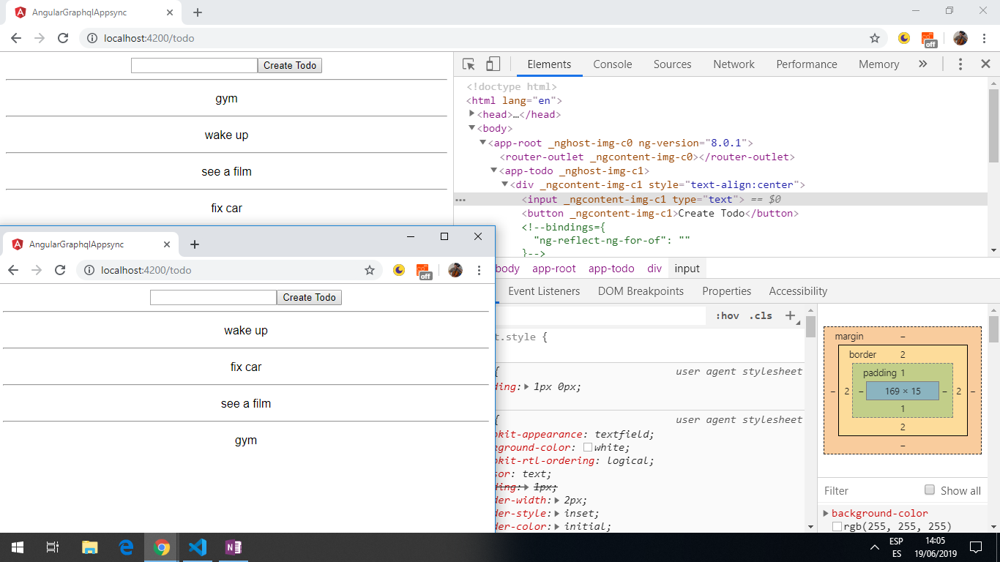

# :zap: Angular GraphQL AppSync

* Requires configuration to new AWS Amplify version
* App using Angular 9 to create a todo list. AWS amplify and appsync are used to communicate with the todo database, hosted in a GraphQL serverless AWS backend.
* The home screen displays an AWS authorization page. Once authorised the user can create todos that are listed in the UI.
* Amplify GraphQL Client used to create queries and mutations. Subscriptions also created so when a todo item is added it is seen by all users via the subscription service.

*** Note: to open web links in a new window use: _ctrl+click on link_**

## :page_facing_up: Table of contents

* [:zap: Angular GraphQL AppSync](#zap-angular-graphql-appsync)
  * [:page_facing_up: Table of contents](#page_facing_up-table-of-contents)
  * [:books: General info](#books-general-info)
  * [:camera: Screenshots](#camera-screenshots)
  * [:signal_strength: Technologies](#signal_strength-technologies)
  * [:floppy_disk: Setup](#floppy_disk-setup)
  * [:computer: Code Examples](#computer-code-examples)
  * [:cool: Features](#cool-features)
  * [:clipboard: Status & To-Do List](#clipboard-status--to-do-list)
  * [:clap: Inspiration](#clap-inspiration)
  * [:envelope: Contact](#envelope-contact)

## :books: General info

* [AWS Amplify](https://aws.amazon.com/amplify/?nc1=h_ls) makes it easy to create, configure, and implement scalable mobile and web apps powered by AWS. It provides a framework to integrate the backend with iOS, Android, Web, and React Native frontends. It allows you to select the capabilities needed, a.g. authorization, analytics or offline data sync.

## :camera: Screenshots

.



## :signal_strength: Technologies

* [Angular v9](https://angular.io/)
* [RxJS Library v6](https://angular.io/guide/rx-library) used to [subscribe](http://reactivex.io/documentation/operators/subscribe.html) to the API data [observable](http://reactivex.io/documentation/observable.html).
* [aws-amplify v3](https://www.npmjs.com/package/aws-amplify) core Javascript library. [Documentation](https://aws-amplify.github.io/docs/js/start?platform=purejs)
* [aws-amplify-angular v5](https://www.npmjs.com/package/aws-amplify-angular) AWS Amplify library package, with building blocks for Angular App development.

## :floppy_disk: Setup

* Requires an AWS account and for Aws Amplify to be configured: [ref documentation](https://docs.amplify.aws/start/getting-started/installation/q/integration/angular#option-1-watch-the-video-guide)
* npm i --save-dev @angular-devkit/build-angular
* Once app fixed: Install dependencies using `npm i` then run `ng serve` for a dev server. Navigate to `http://localhost:4200/`. The app automatically reloads if you change any of the source files.

## :computer: Code Examples

* `todo.component.ts` extract from ngOnInit showing todoListener subcription.

```Typescript
async ngOnInit() {
  const result = await this.api.ListTodos();
  this.allTodos = result.items;

  // on init subscribe to all todos
  this.api.OnCreateTodoListener.subscribe({
    next: (todo: any) => {
      const newTodo = todo.value.data.onCreateTodo;
      this.allTodos.push(newTodo);
    }
  });
}
```

## :cool: Features

* Subscription service used so all users can see mutations to data.

## :clipboard: Status & To-Do List

* Status: After Angular 9 upgrade not working.
* To-Do: Configure AWS Amplify: [ref documentation](https://docs.amplify.aws/start/getting-started/installation/q/integration/angular#option-1-watch-the-video-guide)

## :clap: Inspiration

* [AWS AppSync Tutorial - GraphQL APIs with AppSync, Amplify and Angular](https://www.youtube.com/watch?v=QEMfnr5MO1w)

## :envelope: Contact

* Repo created by [ABateman](https://www.andrewbateman.org) - you are welcome to [send me a message](https://andrewbateman.org/contact)
